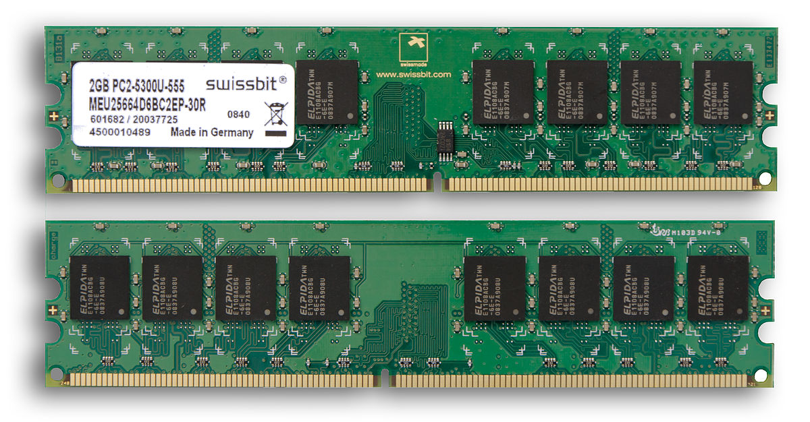
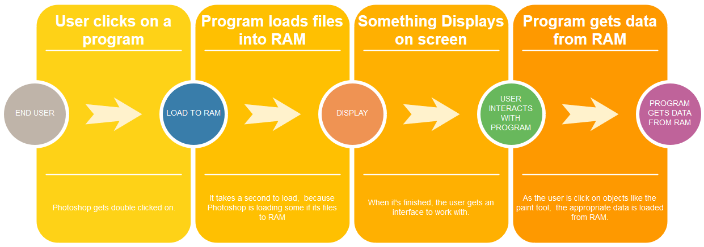
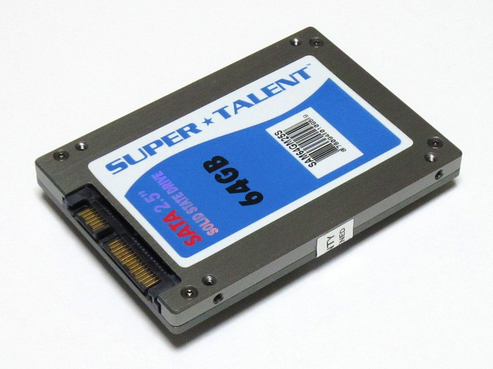

# Computer structure

John von Neumann computer model

Almost all modern computers are based on Von Neumann structure.

Parts:
 - CPU - Central Processing Unit
 - RAM - Random Access Memory
 - Input: Keyboard, Mouse, Camera
 - Output: Monitor, Speaker
 - Secondary Storage: SSD, HDD

## CPU

The brain of the computer. There are billions of small parts called transistors, which simply put are a small mechanism, which either lets the signal pass or blocks it.

CPU is the brain of the computer. It executed the instructions sent to it sequantially one by one.

## RAM

RAM stores program instructions to execute. Everytime a program needs to be executed or opened, it first loaded into RAM. 

RAM is ***volatile**, meaning the content is erased when the computer is restarted.

## Secondary storage

Secondary storage is permanent storage and ***non-volatile***. All the programs and its data is stores on secondary drives. When the program is needed it is loaded into high-speed RAM.