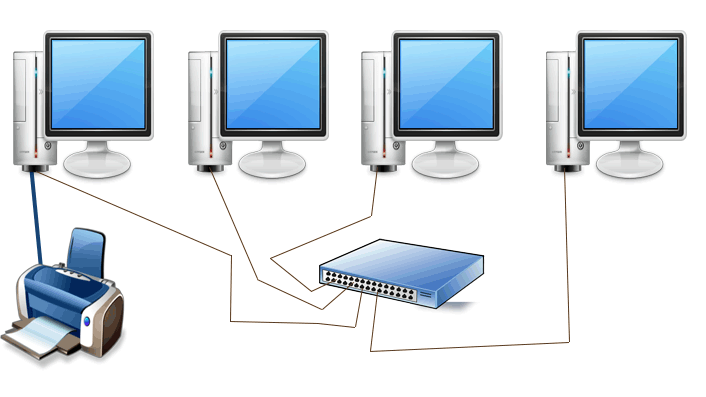

# What is Network?
A network is a way to get "stuff" between 2 or more "things".
Examples: Mail, phone system, conversations, railroad system, highways and roads.

Example of a simple network

There are three types of networks: 
1. LAN - Local Area Network
2. WAN - Wide Area Network
3. Internet

## LAN
A single collection of machines & peripherals. 

Generally less than 1000 computers.

"Spanned" generally less than 250 meters feet.

Basic building block for larger networks-Internetworks.

When you connect multiple LANs together you get Inter and Intra networks. A network of networks. It could simply mean multiple floors of the same building, campus or manu buildings (university, bank office, airport).

## WAN
Spans kilometers of distance.

Two or more separate locations.

Down the road or across the world.

For example, all ATMs connected to the private network of their bank. The bank could be in the same location or if the atm is in mall, the bank could be on the other end of the town.

## Internet
A WAN internetwork.

Millions of machines worldwide.

The World Wide Web (WWW).

# Client - Server
Client requests resources from the server (video, images, web pages, json data etc.) and the server responds with the requested resources.

For example, when you open the youtube website, it goes to the server of youtube through the internet, requests the web page of youtube. Youtube then returns the HTML web page, after you choose the video, the server is communicated once more tiem to request for the video you would like to watch.