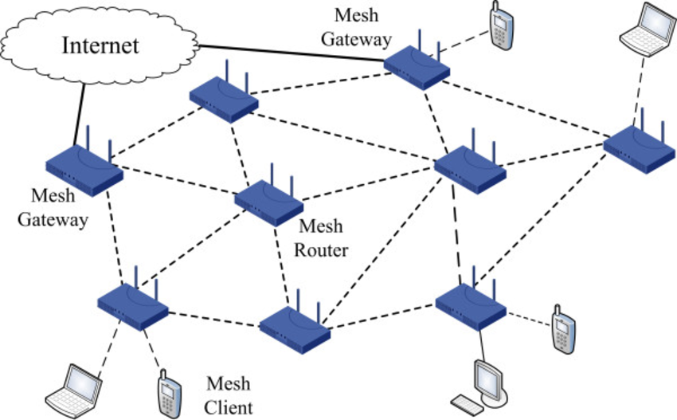
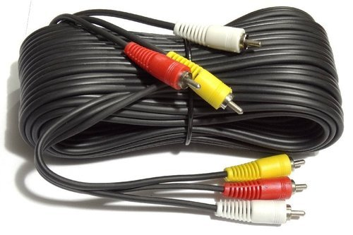

# What is Network?
A network is a way to get "stuff" between 2 or more "things".
Examples: Mail, phone system, conversations, railroad system, highways and roads.

Example of a simple network

There are three types of networks: 
1. LAN - Local Area Network
2. WAN - Wide Area Network
3. Internet

## LAN
A single collection of machines & peripherals. 

Generally less than 1000 computers.

"Spanned" generally less than 250 meters feet.

Basic building block for larger networks-Internetworks.

When you connect multiple LANs together you get Inter and Intra networks. A network of networks. It could simply mean multiple floors of the same building, campus or manu buildings (university, bank office, airport).

## WAN
Spans kilometers of distance.

Two or more separate locations.

Down the road or across the world.

For example, all ATMs connected to the private network of their bank. The bank could be in the same location or if the atm is in mall, the bank could be on the other end of the town.

## Internet
A WAN internetwork.

Millions of machines worldwide.

The World Wide Web (WWW).

# Client - Server
Client requests resources from the server (video, images, web pages, json data etc.) and the server responds with the requested resources.


For example, when you open the youtube website, it goes to the server of youtube through the internet, requests the web page of youtube. Youtube then returns the HTML web page, after you choose the video, the server is communicated once more tiem to request for the video you would like to watch.

# WWW and Internet
The Internet is a global network of networks while the Web, also referred formally as World Wide Web (www) is collection of information which is accessed via the Internet. Another way to look at this difference is; the Internet is infrastructure while the Web is service on top of that infrastructure. 

Alternatively, the Internet can be viewed as a big book-store while the Web can be viewed as collection of books on that store. At a high level, we can even think of the Internet as hardware and the Web as software!


# Hardware of the Internet

## Gateway

A gateway is a node (router) in a computer network, a key stopping point for data on its way to or from other networks. Thanks to gateways, we are able to communicate and send data back and forth. The Internet wouldn't be any use to us without gateways (as well as a lot of other hardware and software).

In a workplace, the gateway is the computer that routes traffic from a workstation to the outside network that is serving up the Web pages. For basic Internet connections at home, the gateway is the Internet Service Provider that gives you access to the entire Internet.

## Router


As mentioned before, a gateway is often associated with a router. A router is hardware—a small piece of computer/network-related equipment that connects you to the Internet. In home networks, the router comes with special software that you install on one computer. You're then able to use the software to set up your home network so everyone allowed on your network can connect to the ISP and the Internet. A router can be connected to two or more networks at a time, but for home networks that's generally not the case.

When you do a Google search or compose an email and hit "Send," your computer sends the data to your router. Your router then, which is hardwired to do its job right, figures out the next destination of the data based on its "comprehension" of the condition of the networks.

# Networking model


## Physical layer
The actual cables or microwave (wireless) that are used to transmit the electrical signals.

### Copper cable


Although it's being slowly replaced by fiber optics, especially for transporting TV signals over significant distances, coaxial cable is still the medium of choice for simple video connections and for many CATV (Community Antenna Television) systems.

### Fiber optics


Optical Fiber - The medium of transmission is light. Light waves have an extremely high frequency and travel at 186,000-miles (300,000Km) per second. A single OF cable can theoretically carry trillions of bits of information every second.

Advantages of Optional Fiber:
- Much greater capacity. The information carrying capacity of OF is thousands of times greater than a normal copper wire. Note on the right the comparison between an optical fiber link and a telephone cable with its hundreds of wires. Both have the same information carrying capacity.
- Low and very uniform attenuation (signal loss) over a wide frequency range. This greatly simplifies amplification of the signal.
- Virtual immunity to all types of interference  
- Insensitivity to temperature variations
- Extremely small size
- Will not short out in bad weather or even in water
- Low cost
- High reliability The fibers do not corrode or break down in moisture or salt air the way copper wires do.
- Light weight Since they are not based on metal conductors, OF cables are lighter and much easier to transport and install.

### Wireless
Uses microwave radio waves in the 2.4Ghz (802.11b and g) and 5.4Ghz (802.11a and n) bands to transmit data. These are unregulated frequencies, so other things (cordless phones, etc.) can use the same frequencies, but hopefully one or the other is smart enough to hop frequencies to stay clear of the other.


## Data layer
The data layer takes the 1's and 0's handed it by the Network layer and turns them into some kind of signal that can go over the physical layer (electrical current, light pulses, microwaves, etc.) It also takes this signal and turns it back into 1's and 0's to pass up the stack on the receiving end.

### Ethernet protocol
Ethernet is 10Mbit (10 million bits per second) only. Fast ethernet, which has nearly the same rules, is 100Mbit only. Gigabit ethernet is 1000Mbit only. Some Network Interface Cards (NIC's) can speak at 10 or 100 (and sometimes 10 or 100 or 1000) but each end has to be using the same speed or there's no connection. 10Mbit at one end and 100Mbit at the other end won't work.

Since there can be many users on an ethernet network, everyone has to have their own unique address.

This is called the Media Access Control (or MAC) address, or sometimes ethernet address, physical address, adaptor address, hardware address, etc.

It's a 12-digit (48 bit) hexadecimal address that is unique to that ethernet adaptor and no other in the world. It can be written as 00:30:65:83:fc:0a or 0030.6583.fc0a or 003065:83fc0a or 00-30-65-83-fc-0a but they all mean the same thing.

The first 6 digits are the Vendor code, (003065 belongs to Apple), the last 6 are the individual inteface's own. Like a car's VIN. See http://coffer.com/mac_find/ to look up some vendor codes.

To find out your mac address, open windows console and type: 
```bash
ipconfig /all
```

To send someone a message, start with a broadcast asking "where's Bob?" Everyone's supposed to look at broadcasts.
"Bob" replies, in his reply, he includes his ethernet address. Since every ethernet packet has the destination and sender address listed, "Bob" knows your address (from your broadcast packet) so doesn't have to start with a broadcast.
For the rest of the conversation, you'll put each other's address as the destination (and yours as the sender), so the conversation can pass along the ethernet media between you.
Who's "Bob" and how did he get that name? That's a layer 3 (Network) problem, layer 2 (Data) doesn't care.

## Network layer
Network packets can be routed. This means they can be passed from one local network to another. Data layer packets can't be routed, they're local only. Your computer can only get data layer packets on its data layer interface, so network layer packets have to be stuffed inside the data layer packets. This is called "encapsulation" and is why a layered model is so handy. 

When you link computers up, via layers 1 (Physical) and 2 (Data) you get a network. When you link networks up, you get an internetwork. You need the Network layer (3) to get data between all the little networks (often called subnets) of your internetwork. 

The protocol for Network Layer: Internet Protocol (IP).

The Internet Protocol (IP) is the Network layer protocol used on the Internet! It’s so handy that most everyone uses it on all their networks big and small. 

ARP: Address Resolution Protocol. Turns an IP number into an ethernet number, very important. Instead of asking "Who's Bob?" you ask "Who's 172.19.4.15" and if you get a reply, associate the ethernet address with the IP address in your arp table, and now you can keep sending your data to the intended recipient via the correct ethernet address.

### IP addressing
IP addresses consists of 4 "octets" such as: 171.64.20.23
Each "octet" consists of numbers between 0 and 255
It works sort of like the phone system, with "area codes" to the left, then "prefix" etc. but more flexible. On university campus, your computer will know that "171.64." means "Stanford" while it will figure out that "20" means "Pine Hall" and will learn that "23" means the computer called "networking."

### DNS - Domain Name Resolution

Since most people find it easier to remember names instead of numbers, IP numbers can and almost always are associated with names.

Your computer, however, needs a number, so the Domain Name System (DNS) exists to make everyone happy.

A name, such as maps.google.com tells you the first (or top) level domain (.com, for private companies) the second level domain (google) and the actual host's name (maps). 
If google makes a new DNS record, you will still ask the google server for it. When you need to go outside of google, let's say to facebook.com, you will still most probably go through the google server (or your ISP) and it then will figure out where to ask for the server address next.

Your computer needs DNS servers to know who to ask to resolve the DNS name. If you are at home, you will be automatically assigned ones from your ISP. You could also manually change them to any others (in office, they will be assigned automatically as well).

### IP Routing
As mentioned before, you can only send ethernet packets out of your ethernet interface, and ethernet packets stay on your local network.
You can put an IP (Network layer) packet inside of an ethernet (data layer) packet, but somebody's got to pass it along, and that somebody's a router.
Every IP number not on your local network will "belong" to your router in your ARP table.
If you want to talk to someone outside your local network, you'll send that ethernet packet to your router's ethernet address and trust that it will work afterwards. It's out of your hands now.

It knows which is a public and which is a private using mask, but there is a simple list to remember for private IP addresses:
1. 10.0.0.0 to 10.255.255.255
2. 172.16.0.0 to 172.31.255.255
3. 192.168.0.0 to 192.168.255.255

### Routers
Routers keep tables of networks, often many and often large.
Routers know: 1- Networks directly connected to them (sometimes one or two, sometimes a hundred or more), 2- Networks connected to their "friends and neighbors" and 3- The "default route" for everything else.

When your ethernet packet arrives at the router, it takes the Network packet (and all its contents), looks at the destination IP number, checks its tables, and sends a new ethernet (or other layer 2) packet (where the "sender" is now the router, not you) out the (hopefully) correct interface. That may go to the final host if it's on one of the routers directly connected networks, or to another router, which does the same process, until your packet gets to the router responsible for that local network, who then sends your packet to to the intended host. Whether your final destination host is in the next building or on the other side of the world, it works the same way.  

### Tools for networking
Ping and Traceroute are two somewhat useful tools for looking at and learning about your network.

Ping sends a small packet to a host which may or may not choose to reply to it, and times how long the packet takes to get back. Lack of a reply doesn’t indicate a problem with the host or network.

Traceroute asks all routers along the path between you and the destination host if they'd like to respond to you, and times how long each of 3 requests take to get back to you. Some routers may not respond, but may still pass the traceroute packet along, and many hosts will not reply to the traceroute inquiry at all. Lack of a reply doesn't indicate a problem with the host or network.
