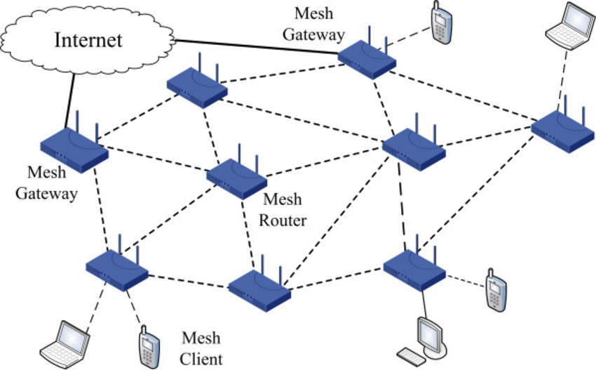
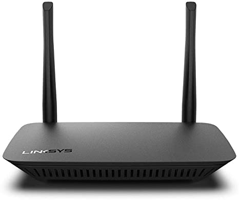

# WWW and Internet
The Internet is a global network of networks while the Web, also referred formally as World Wide Web (www) is collection of information which is accessed via the Internet. Another way to look at this difference is; the Internet is infrastructure while the Web is service on top of that infrastructure. 

Alternatively, the Internet can be viewed as a big book-store while the Web can be viewed as collection of books on that store. At a high level, we can even think of the Internet as hardware and the Web as software!

# Hardware of the Internet

## Gateway

A gateway is a node (router) in a computer network, a key stopping point for data on its way to or from other networks. Thanks to gateways, we are able to communicate and send data back and forth. The Internet wouldn't be any use to us without gateways (as well as a lot of other hardware and software).

In a workplace, the gateway is the computer that routes traffic from a workstation to the outside network that is serving up the Web pages. For basic Internet connections at home, the gateway is the Internet Service Provider that gives you access to the entire Internet.

## Router

As mentioned before, a gateway is often associated with a router. A router is hardware—a small piece of computer/network-related equipment that connects you to the Internet. In home networks, the router comes with special software that you install on one computer. You're then able to use the software to set up your home network so everyone allowed on your network can connect to the ISP and the Internet. A router can be connected to two or more networks at a time, but for home networks that's generally not the case.

When you do a Google search or compose an email and hit "Send," your computer sends the data to your router. Your router then, which is hardwired to do its job right, figures out the next destination of the data based on its "comprehension" of the condition of the networks.
