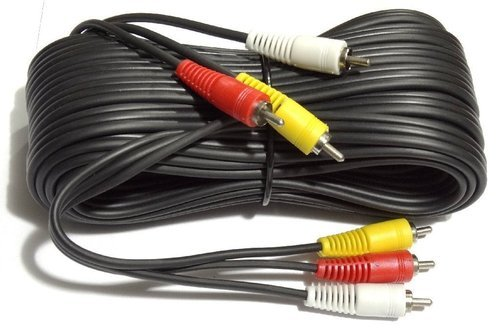
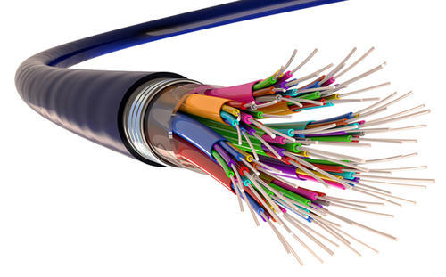

# Networking model


## Physical layer
The actual cables or microwave (wireless) that are used to transmit the electrical signals.

### Copper cable


Although it's being slowly replaced by fiber optics, especially for transporting TV signals over significant distances, coaxial cable is still the medium of choice for simple video connections and for many CATV (Community Antenna Television) systems.

### Fiber optics


Optical Fiber - The medium of transmission is light. Light waves have an extremely high frequency and travel at 186,000-miles (300,000Km) per second. A single OF cable can theoretically carry trillions of bits of information every second.

Advantages of Optional Fiber:
- Much greater capacity. The information carrying capacity of OF is thousands of times greater than a normal copper wire. Note on the right the comparison between an optical fiber link and a telephone cable with its hundreds of wires. Both have the same information carrying capacity.
- Low and very uniform attenuation (signal loss) over a wide frequency range. This greatly simplifies amplification of the signal.
- Virtual immunity to all types of interference  
- Insensitivity to temperature variations
- Extremely small size
- Will not short out in bad weather or even in water
- Low cost
- High reliability The fibers do not corrode or break down in moisture or salt air the way copper wires do.
- Light weight Since they are not based on metal conductors, OF cables are lighter and much easier to transport and install.

### Wireless
Uses microwave radio waves in the 2.4Ghz (802.11b and g) and 5.4Ghz (802.11a and n) bands to transmit data. These are unregulated frequencies, so other things (cordless phones, etc.) can use the same frequencies, but hopefully one or the other is smart enough to hop frequencies to stay clear of the other.


## Data layer
The data layer takes the 1's and 0's handed it by the Network layer and turns them into some kind of signal that can go over the physical layer (electrical current, light pulses, microwaves, etc.) It also takes this signal and turns it back into 1's and 0's to pass up the stack on the receiving end.

### Ethernet protocol
Ethernet is 10Mbit (10 million bits per second) only. Fast ethernet, which has nearly the same rules, is 100Mbit only. Gigabit ethernet is 1000Mbit only. Some Network Interface Cards (NIC's) can speak at 10 or 100 (and sometimes 10 or 100 or 1000) but each end has to be using the same speed or there's no connection. 10Mbit at one end and 100Mbit at the other end won't work.

Since there can be many users on an ethernet network, everyone has to have their own unique address.

This is called the Media Access Control (or MAC) address, or sometimes ethernet address, physical address, adaptor address, hardware address, etc.

It's a 12-digit (48 bit) hexadecimal address that is unique to that ethernet adaptor and no other in the world. It can be written as 00:30:65:83:fc:0a or 0030.6583.fc0a or 003065:83fc0a or 00-30-65-83-fc-0a but they all mean the same thing.

The first 6 digits are the Vendor code, (003065 belongs to Apple), the last 6 are the individual inteface's own. Like a car's VIN. See http://coffer.com/mac_find/ to look up some vendor codes.

To find out your mac address, open windows console and type: 
```bash
ipconfig /all
```

To send someone a message, start with a broadcast asking "where's Bob?" Everyone's supposed to look at broadcasts.
"Bob" replies, in his reply, he includes his ethernet address. Since every ethernet packet has the destination and sender address listed, "Bob" knows your address (from your broadcast packet) so doesn't have to start with a broadcast.
For the rest of the conversation, you'll put each other's address as the destination (and yours as the sender), so the conversation can pass along the ethernet media between you.
Who's "Bob" and how did he get that name? That's a layer 3 (Network) problem, layer 2 (Data) doesn't care.

## Network layer
Network packets can be routed. This means they can be passed from one local network to another. Data layer packets can't be routed, they're local only. Your computer can only get data layer packets on its data layer interface, so network layer packets have to be stuffed inside the data layer packets. This is called "encapsulation" and is why a layered model is so handy. 

When you link computers up, via layers 1 (Physical) and 2 (Data) you get a network. When you link networks up, you get an internetwork. You need the Network layer (3) to get data between all the little networks (often called subnets) of your internetwork. 

The protocol for Network Layer: Internet Protocol (IP).

The Internet Protocol (IP) is the Network layer protocol used on the Internet! It’s so handy that most everyone uses it on all their networks big and small. 

ARP: Address Resolution Protocol. Turns an IP number into an ethernet number, very important. Instead of asking "Who's Bob?" you ask "Who's 172.19.4.15" and if you get a reply, associate the ethernet address with the IP address in your arp table, and now you can keep sending your data to the intended recipient via the correct ethernet address.
