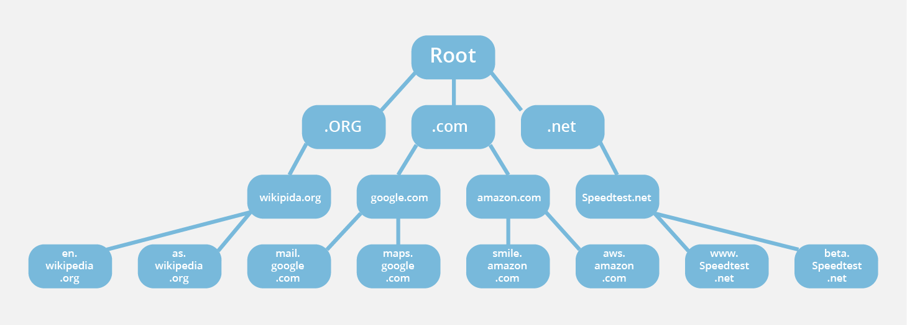

# DNS - Domain Name Resolution

Since most people find it easier to remember names instead of numbers, IP numbers can and almost always are associated with names.

Your computer, however, needs a number, so the Domain Name System (DNS) exists to make everyone happy.

A name, such as maps.google.com tells you the first (or top) level domain (.com, for private companies) the second level domain (google) and the actual host's name (maps). 
If google makes a new DNS record, you will still ask the google server for it. When you need to go outside of google, let's say to facebook.com, you will still most probably go through the google server (or your ISP) and it then will figure out where to ask for the server address next.

Your computer needs DNS servers to know who to ask to resolve the DNS name. If you are at home, you will be automatically assigned ones from your ISP. You could also manually change them to any others (in office, they will be assigned automatically as well).

