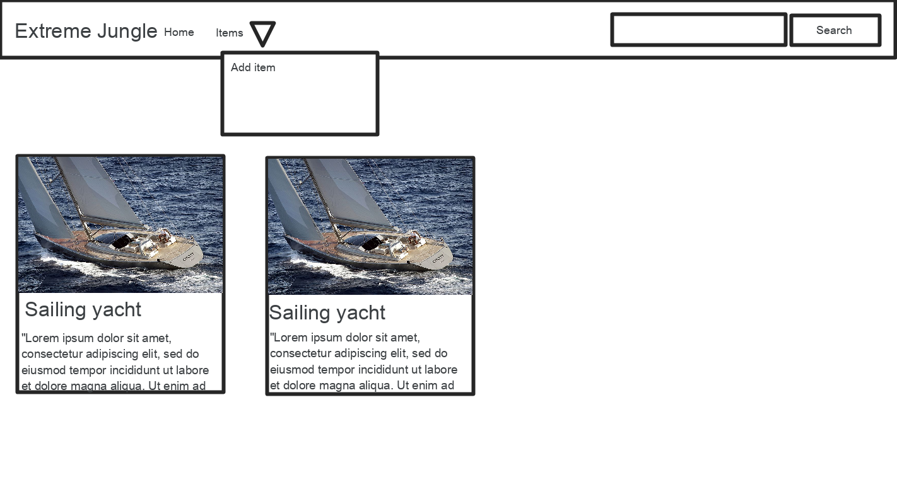
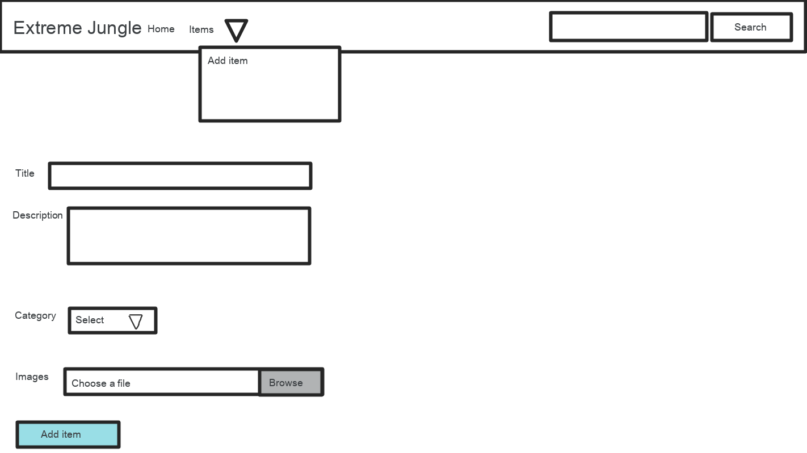

# CSS
CSS stands for Cascading Style Sheets.

CSS saves a lot of work. It can control the layout of multiple web pages all at once.

Cascading Style Sheets (CSS) is used to format the layout of a webpage.

With CSS, you can control the color, font, the size of text, the spacing between elements, how elements are positioned and laid out, what background images or background colors are to be used, different displays for different devices and screen sizes, and much more!

## Using CSS
CSS can be added to HTML documents in 3 ways:

- Inline - by using the style attribute inside HTML elements
- Internal - by using a ```<style>``` element in the <head> section
- External - by using a ```<link>``` element to link to an external CSS file

The most common way to add CSS, is to keep the styles in external CSS files. 

## Inline CSS

An inline CSS is used to apply a unique style to a single HTML element.

An inline CSS uses the style attribute of an HTML element.

```html
<h1 style="color:blue;">A Blue Heading</h1>

<p style="color:red;">A red paragraph.</p>
```

## Internal CSS
An internal CSS is used to define a style for a single HTML page.

An internal CSS is defined in the <head> section of an HTML page, within a ```<style>``` element.


```html
<html>
    <head>
        <style>
            body {
                background-color: powderblue;
            }
            h1 {
                color: blue;
            }
            p {
                color: red;
            }
        </style>
    </head>
    <body>
        <h1>This is a heading</h1>
        <p>This is a paragraph.</p>
    </body>
</html>
```

## External CSS
An external style sheet is used to define the style for many HTML pages.

To use an external style sheet, add a link to it in the ```<head>``` section of each HTML page:

```html
<!DOCTYPE html>
<html>
<head>
  <link rel="stylesheet" href="styles.css">
</head>
<body>
    <h1>This is a heading</h1>
    <p>This is a paragraph.</p>
</body>
</html>
```
And the file ```style.css```:
```css
body {
  background-color: powderblue;
}
h1 {
  color: blue;
}
p {
  color: red;
}
```

CSS has many properties, however it is more common to now write CSS from scratch but instead use existing CSS libraries:
- Bootstrap (https://getbootstrap.com/)
- UIkit (https://getuikit.com/)
- Material Design (https://materializecss.com/)

You can start using them right away in your application and your websites will start looking more proffessional.

To include the bootstrap in your page (CSS only) use:
```html
<link rel="stylesheet" href="https://cdn.jsdelivr.net/npm/bootstrap@4.5.3/dist/css/bootstrap.min.css">
```

## CSS selectors
CSS selectors are used to "find" (or select) the HTML elements you want to style.

### The CSS element Selector
The element selector selects HTML elements based on the element name.

```css
p {
  text-align: center;
  color: red;
}
```
### The CSS id Selector
The id selector uses the id attribute of an HTML element to select a specific element.

The id of an element is unique within a page, so the id selector is used to select one unique element!

To select an element with a specific id, write a hash (#) character, followed by the id of the element.

```css
#para1 {
  text-align: center;
  color: red;
}
```

### The CSS class Selector
The class selector selects HTML elements with a specific class attribute.

To select elements with a specific class, write a period (.) character, followed by the class name.

```css
.center {
  text-align: center;
  color: red;
}
```

## Homework - Shop UI
Create two pages using the bootstrap framework and its components:

### Home page

Home page should have the navbar component (https://getbootstrap.com/docs/4.5/components/navbar/) with search and dropdown menu for Items.

In the middle should have a grid of items - cards (https://getbootstrap.com/docs/4.5/components/card/). Each card should contain an item with image, title and description.

### Add Item page

Add item page should use the bootstrap form (https://getbootstrap.com/docs/4.5/components/forms/). Use appropriate elements for:
- Title - Input text with label
- Description - Textarea with label
- Category - Select with Label
- Images - file browser with label
- Submit button