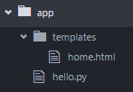

# HTML templates in Flask

Flask uses a library named Jinja, which allows to replace pieces of content in a string (HTML document) with variable that you provide.

This becomes useful in the following scenario:
- User requests a list of items from the browser
- Flask route gets the request, gets items from json file
- Then the data is passed to the html file and Jinja uses templating to replace variables in html with values
- The resulting html is sent to the user with all the data already embedded inside

This flow is called Server-Side-Rendering, which means the server is responsible for both getting the data and returning the final HTML document to the user. 

This is not the only way to develop websites, but the fastest. Another approach is to delegate the server with the role of returning data in JSON format and calling the server (backend) from the frontend. The frontend is then responsible for displaying the data and showing correct HTML.

This approach is called Client-Side rendering, the frameworks for it are: React, Angular, Vue.JS.

## HTML templates
So first let's make a simple html page, which will be returned by our server:
```html
<!DOCTYPE html>
<html>
<body>
    <h1>Hello world</h1>
    <p>This is my website.</p>
</body>
</html>
```
We should put that file inside of ```templates/``` folder within our project, like this:



Now, let's write the hello.py file:
```python
from flask import Flask, render_template
app = Flask(__name__)
@app.route('/')
def home():
    return render_template('home.html')
if __name__ == '__main__':
    app.run(debug=True)
```
If we now launch the server: ```python hello.py``` and open the browser at ```localhost:5000```, we will see our web page.

Let's now add the second page:
```html
<!DOCTYPE html>
<html>
  <body>
   <div class="about">
     <h1>About me</h1>
     <p>This is a portfolio site about anything that can be put in a portfolio.</p>
   </div>
  </body>
</html>
```
Save to the file named: ```about.html```. And change the ```hello.py``` to:
```python
from flask import Flask, render_template
app = Flask(__name__)
@app.route('/')
def home():
    return render_template('home.html')
@app.route('/about')
def about():
    return render_template('about.html')
if __name__ == '__main__':
    app.run(debug=True)
```
As we can see we added a new route: ```/about```, so if the user opens the website at ```/about```, it will show the about page.

