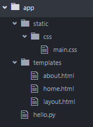

# CSS for Flask

If we want to include custom CSS file in our website, we should follow the following structure:




As you can see, we should make a new folder named static and put inside another folder named css, where we can store as many css files we we want.

Now, if we want to include this file in our ```layout.html``` file:
```html
<!DOCTYPE html>
<html>
  <head>
    <title>Flask app</title>
    <link rel="stylesheet" href="{{ url_for('static', filename='css/main.css') }}">
  </head>
  <body>
    <header>
      <div class="container">
        <h1 class="logo">Ardit's web app</h1>
        <strong><nav>
          <ul class="menu">
            <li><a href="{{ url_for('home') }}">Home</a></li>
            <li><a href="{{ url_for('about') }}">About</a></li>
          </ul>
        </nav></strong>
      </div>
    </header>
    <div class="container">
      
      
    </div>
  </body>
</html>
```

As you can see, we are using the same function ```url_for``` and provide two arguments, first is the folder for our static files and second the filename inside that folder.


Alternatively, we can always incldue bootstrap as we did in the previous lessons.
